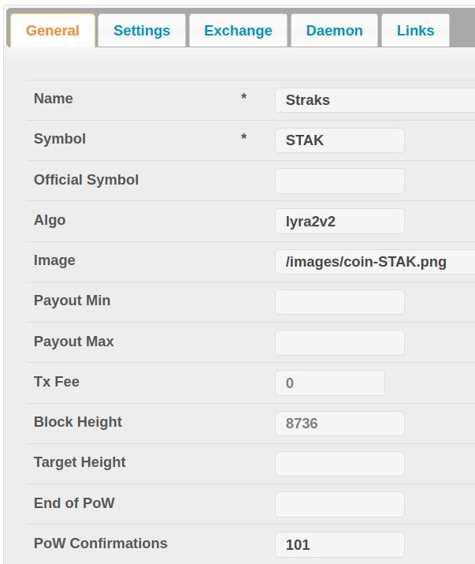
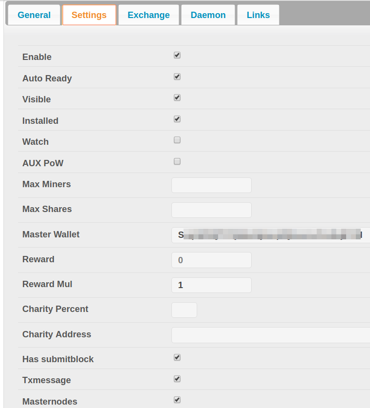
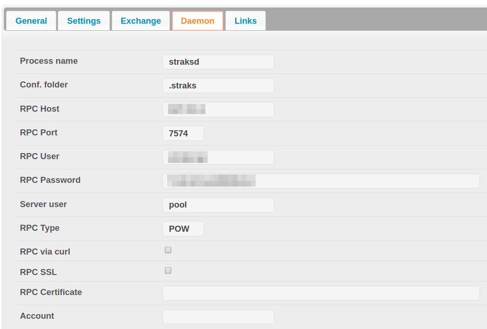

#yiimp - yaamp fork (straks branch)

## Straks

- https://bitcointalk.org/index.php?topic=2433318.0 - Bitcoin Talk thread
- https://github.com/straks/straks - Official Git (sources)
- http://www.straks.io/ - Official Site
- https://straks.info/ - Block Explorer

## How to install in Yiimp?

Changes for Straks in Yiimp is only related to stratum. So, you need to build **stratum binary** from this branch to use it with Yiimp. Here is a needed settings for coin Straks in admin panel of Yiimp:

*General:*

 

*Settings:*

 

*Daemon:*

 

*Sample config:*

	rpcuser=rpcuser
	rpcpassword=rpcpassword
	rpcport=7574
	rpcthreads=8
	rpcallowip=127.0.0.1
	# onlynet=ipv4
	maxconnections=12
	daemon=1
	gen=0
	
	alertnotify=echo %s | mail -s "Straks alert!" alert@example.com
	blocknotify=blocknotify example.com:4533 1987 %s
	

*Miner command line:*

	-a lyra2v2 -o stratum+tcp://example.com:4533 -u SdeckerNMSZkLKwHVZVAGuKANbH8bUn7Ye -p c=STAK 
	

## Donate

- Straks (STAK) - [SdeckerNMSZkLKwHVZVAGuKANbH8bUn7Ye](https://straks.info/address/SdeckerNMSZkLKwHVZVAGuKANbH8bUn7Ye) 
- Bitcoin (BTC) - [19M4m6jvbiDXrF5vbFk9euTuvx9tN37Naj](https://blockchain.info/address/19M4m6jvbiDXrF5vbFk9euTuvx9tN37Naj) 

**p.s.** Original Yiimp doc you can also find in this branch as README.master.md[README.master.md](./README.master.md)  .